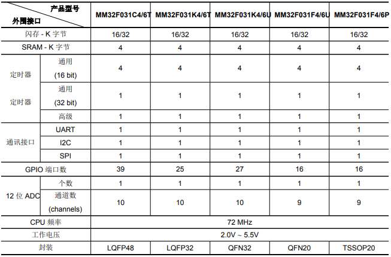

# [MM32F031](https://github.com/SoCXin/MM32F031)

#### [MindMotion](http://www.mindmotion.com.cn/)：[Cortex M0](https://github.com/SoCXin/CM0)
#### [Level](https://github.com/SoCXin/Level)：72 MHz

## [描述](https://github.com/SoCXin/MM32F031/wiki)

[MM32F031](https://github.com/SoCXin/MM32F031) 包含1个 12 位的 ADC、1 个 16 位通用定时器、1 个 32 位通用定时器、3 个 16 位基本定时器、1个 16 位高级定时器。还包含标准的通信接口：1 个 I2C 接口、1 个 SPI 接口和 1 个 UART接口。

### 芯片特性

* 工作电压为 2.0V ∼ 5.5V，工作温度范围包含 -40◦C ∼ +85◦C (常规型)和 -40◦C ∼ +105◦C (扩展型)

### [资源收录](https://github.com/SoCXin/MM32F031)

* [文档](docs/)
* [资源](src/)
* [工程](project/)

### [选型建议](https://github.com/SoCXin)

[MM32F031](https://github.com/SoCXin/MM32F031) Cortex M0内核，的外设配置中规中矩，Q版主频72M，N版具有PLL可达200M。

[MM32F031](https://github.com/SoCXin/MM32F031)相比于[MM32F032](https://github.com/SoCXin/MM32F032) 少了RTC

###  [芯云 www.SoC.Xin](http://www.SoC.Xin)
